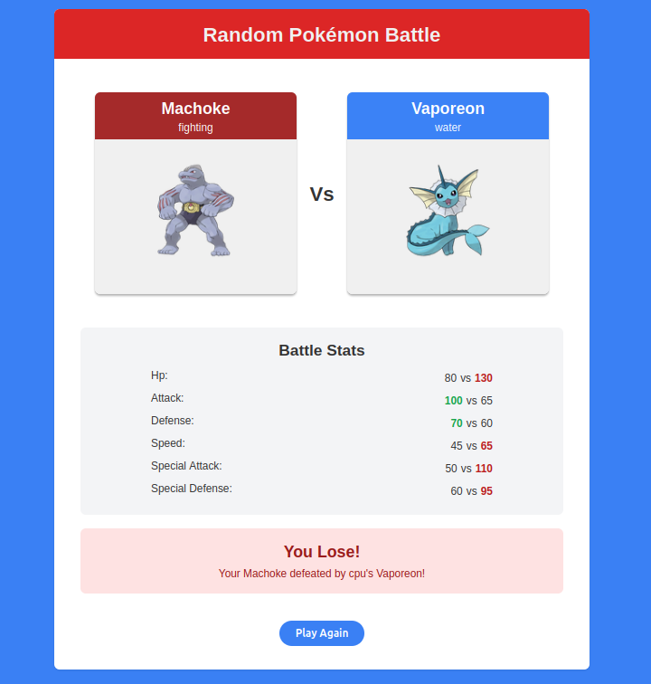

# Random Pokémon Battle 🎮⚡

> A thrilling Pokémon battle game built during our Full-Stack Developers Institute Bootcamp Hackathon

## 🎯 About The Project

Random Pokémon Battle is an interactive web-based game where players can catch random Pokémon and battle against a CPU opponent. Built from scratch in just one week during our bootcamp hackathon, this project showcases the power of modern web technologies and the PokéAPI.

**Developers:**

- [Amit](https://github.com/TeaTimeJack)
- [Biniyam](https://github.com/BiiN12)

**Timeline:** 1 week intensive development during Developers Institute Bootcamp Hackathon

## 🎮 Live Demo

🚀 **[Play the Game Now!](https://random-pokemon-battle.netlify.app/)**

_Experience the thrill of random Pokémon battles directly in your browser!_

## ✨ Features

### Current Features

- **Generation Selection**: Choose from all 9 Pokémon generations (Gen 1-9)
- **Random Pokémon Catching**: Use Poké Balls to catch random Pokémon
- **Strategic Gameplay**: Hold your current Pokémon or throw again (3 Poké Balls limit)
- **Battle System**: Automatic stat comparison between your Pokémon and CPU's Pokémon
- **Type Effectiveness**: Advanced tie-breaker system using Pokémon type advantages
- **Visual Battle Interface**: Beautiful cards showing Pokémon images, types, and stats
- **Animated Transitions**: Smooth loading animations and stat reveals
- **Responsive Design**: Works perfectly on desktop and mobile devices

### Game Mechanics

1. **Choose Generation**: Select which Pokémon generations you want to include
2. **Catch Pokémon**: Click the Poké Ball to catch a random Pokémon
3. **Strategic Decision**: Hold your Pokémon or use another Poké Ball to catch a different one
4. **Battle Phase**: Face off against a randomly selected CPU Pokémon
5. **Stat Comparison**: Win by having superior stats across 6 categories:
   - HP (Hit Points)
   - Attack
   - Defense
   - Speed
   - Special Attack
   - Special Defense
6. **Type Advantage**: If stats are tied, type effectiveness determines the winner

## 🛠️ Tech Stack

- **Frontend**: TypeScript, HTML5, CSS3
- **Build Tool**: Vite
- **API**: PokéAPI (https://pokeapi.co/)
- **Icons**: Font Awesome
- **Styling**: Custom CSS with responsive design

## 📁 Project Structure

```
Random_pokemon_battle/
├── Random-Pokemon-Battle/           # Main game directory
│   ├── src/
│   │   ├── main.ts                 # Entry point and generation selection
│   │   ├── play-game-noloops.ts    # Core game logic
│   │   ├── get-Random-Pokemon.ts   # PokéAPI integration
│   │   ├── compare-Stats-Visialy.ts # Battle system and UI
│   │   ├── type-object.ts          # Type definitions and data
│   │   └── style.css               # Game styling
│   ├── public/                     # Static assets
│   ├── index.html                  # Main HTML file
│   ├── package.json               # Dependencies
│   └── tsconfig.json              # TypeScript configuration
├── flow-chart.png                 # Game flow visualization
├── PRG-task-manager.docx          # Development progress tracking
└── Pokemon-random-game-idea.docx  # Initial game concept
```

## 🚀 Getting Started

### Prerequisites

- Node.js (v16 or higher)
- npm or yarn

### Installation

1. **Clone the repository**

   ```bash
   git clone https://github.com/BiiN12/random-pokemon-battle.git
   cd random-pokemon-battle
   ```

2. **Navigate to the game directory**

   ```bash
   cd Random-Pokemon-Battle
   ```

3. **Install dependencies**

   ```bash
   npm install
   ```

4. **Start the development server**

   ```bash
   npm run dev
   ```

5. **Build for production**
   ```bash
   npm run build
   ```

## 🎯 How to Play

1. **Select Generations**: Click on the generation buttons to choose which Pokémon you want to encounter
2. **Catch Your Pokémon**: Click the Poké Ball to catch a random Pokémon from your selected generations
3. **Make Your Choice**:
   - **Hold**: Keep your current Pokémon and proceed to battle
   - **Throw Again**: Use another Poké Ball to catch a different Pokémon (you have 3 total)
4. **Battle**: Your Pokémon will automatically battle against a random CPU Pokémon
5. **Win Conditions**: Win by having better overall stats or type advantage in case of a tie
6. **Play Again**: Click "Play Again" to start a new battle!

## 🏆 Game Screenshots



<!-- - Generation selection screen
- Pokémon catching interface
- Battle comparison screen
- Victory/defeat results -->

## 🔮 Future Updates & Todo List

### 📋 Planned Features

- [ ] **User Authentication System**

  - User registration and login
  - Secure password management
  - User profiles with avatars

- [ ] **Database Integration**

  - PostgreSQL/MongoDB for data persistence
  - User game history tracking
  - Win/loss statistics
  - Favorite Pokémon collections

- [ ] **Enhanced Gameplay**

  - [ ] Multiplayer battles (player vs player)
  - [ ] Tournament mode
  - [ ] Pokémon team building (6 Pokémon teams)
  - [ ] Level up system for caught Pokémon
  - [ ] Pokémon evolution mechanics

- [ ] **Social Features**

  - [ ] Leaderboards and rankings
  - [ ] Friend system
  - [ ] Battle history sharing
  - [ ] Achievement system

- [ ] **UI/UX Improvements**

  - [ ] Dark/Light mode toggle
  - [ ] Sound effects and background music
  - [ ] Advanced animations and battle effects
  - [ ] Mobile app version (React Native)

- [ ] **Advanced Battle System**
  - [ ] Move-based battles instead of stat comparison
  - [ ] Status effects (poison, burn, paralysis, etc.)
  - [ ] Critical hits and accuracy system
  - [ ] Weather effects

## 🤝 Contributing

We welcome contributions from the community! Here's how you can help:

1. **Fork the repository**
2. **Create a feature branch** (`git checkout -b feature/AmazingFeature`)
3. **Commit your changes** (`git commit -m 'Add some AmazingFeature'`)
4. **Push to the branch** (`git push origin feature/AmazingFeature`)
5. **Open a Pull Request**

### Contribution Guidelines

- Follow TypeScript best practices
- Maintain consistent code formatting
- Add comments for complex logic
- Test your changes thoroughly
- Update documentation as needed

## 🐛 Known Issues

- Loading times may vary depending on PokéAPI response times
- Some Pokémon images might not load if PokéAPI is experiencing issues
- Game state is not persisted between sessions (will be fixed with database integration)

## 📊 API Usage

This project uses the [PokéAPI](https://pokeapi.co/) to fetch Pokémon data:

- **Endpoint**: `https://pokeapi.co/api/v2/pokemon/{id}/`
- **Rate Limit**: No authentication required, but please be respectful with API calls
- **Data Used**: Pokémon stats, images, names, and types

## 📜 License

This project is licensed under the MIT License - see the [LICENSE](LICENSE) file for details.

## 🙏 Acknowledgments

- **Developers Institute Bootcamp** for providing the hackathon opportunity
- **PokéAPI** for the comprehensive Pokémon database
- **Nintendo/Game Freak** for creating the Pokémon universe
- **Font Awesome** for the beautiful icons
- **Our Instructors** for their guidance and support

## 📞 Contact

**Biniyam** - [biniyameshete12@gmail.com](mailto:biniyameshete12@gmail.com)  
**Amit** - [amitjack14@gmail.com](mailto:amitjack14@gmail.com)

**Project Link**: [https://github.com/BiiN12/random-pokemon-battle](https://github.com/BiiN12/Random_pokemon_battle)

---

⭐ **Don't forget to star this repository if you enjoyed the game!** ⭐

---

_Built with ❤️ during the Developers Institute Bootcamp Hackathon_
